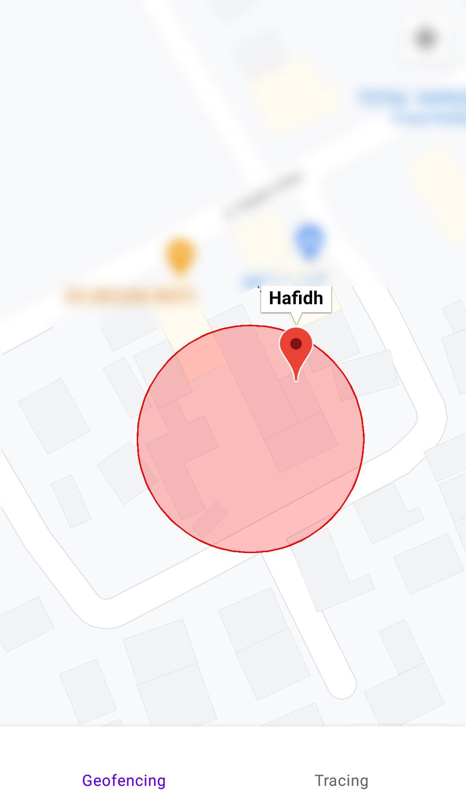
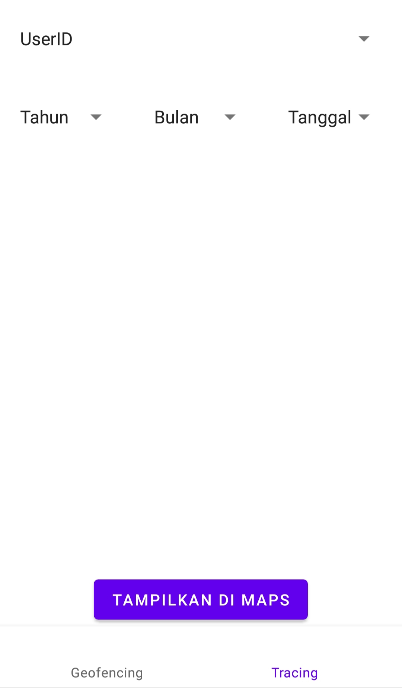
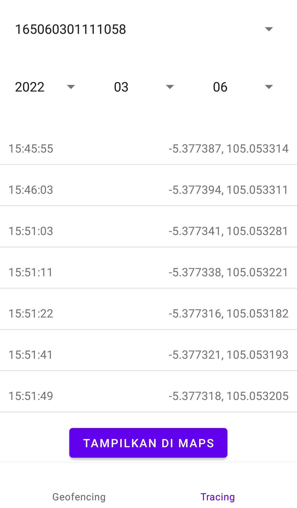
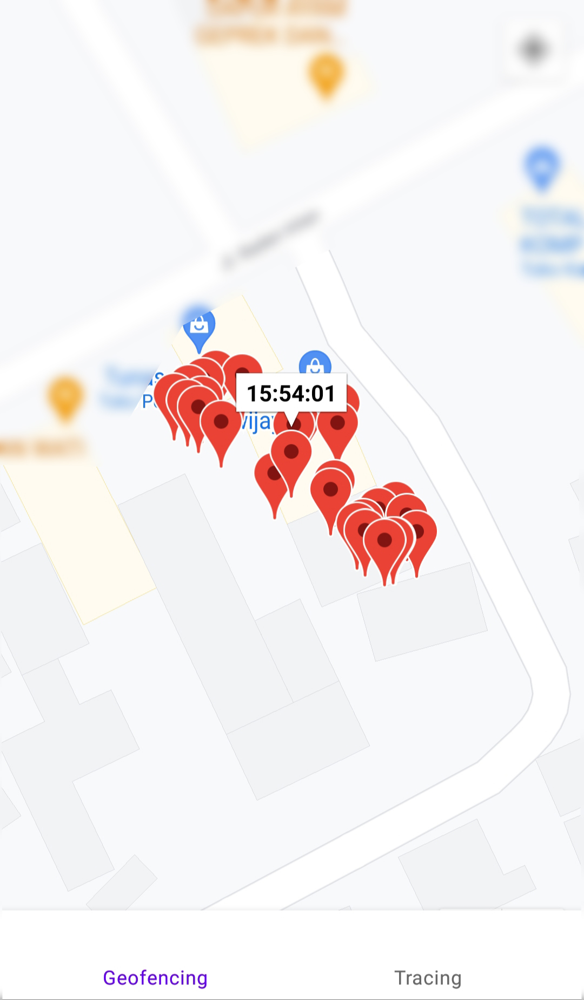

# Patient-Surveillance-APPS
Apps to show notificatian when patient leave the geofencing zone (quarantine zone).  
Apps get patient position from [Geofencing Device (NodeMCU ESP8266)](https://github.com/hafidhh/Patient-Surveillance-ESP8266)  

## images

